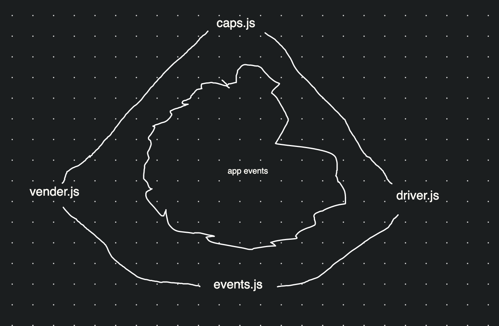
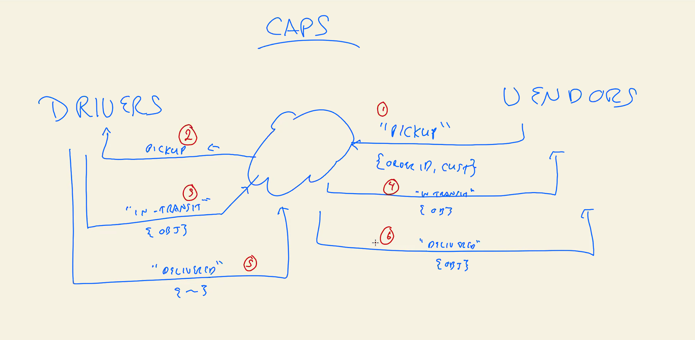

# LAB - Class lab 12

## Project: caps.driver.vender

### Author: Kale Lesko

### Links and Resources

- [caps2](https://github.com/Saynka/caps2)
- [ci/cd-caps2](https://github.com/Saynka/caps2/actions) (GitHub Actions)
- [vender](https://github.com/Saynka/vender)
- [ci/cd-vender](https://github.com/Saynka/vender/actions) (GitHub Actions)
- [driver](https://github.com/Saynka/driver)
- [ci/cd-driver](https://github.com/Saynka/driver/actions) (GitHub Actions)

### Setup

.
├── LICENSE
├── README.md
├── **tests**
│ └── caps.test.js
├── assets
├── index.js
├── modules
│ └── caps.js
├── package-lock.json
└── package.json

#### `.env` requirements (where applicable)

i.e.

- `PORT` - Port Number
- `MONGODB_URI` - URL to the running mongo instance/db

#### How to initialize/run your application (where applicable)

- e.g. `npm start`

#### How to use your library (where applicable)

#### Tests

- How do you run tests?
- Any tests of note?
- Describe any tests that you did not complete, skipped, etc

#### UML

